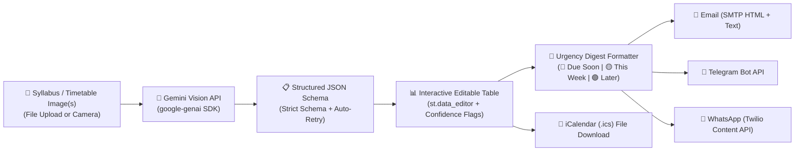

# 📅 DeadlineSnap

> **Turn messy syllabi, timetables, and assignment sheets into structured, actionable deadlines and automated alerts using Gemini Vision.**

[](https://deadlinesnap.streamlit.app/)
[](https://www.python.org/downloads/)
[](https://opensource.org/licenses/MIT)

🔗 **Live Deployed App**: [https://deadlinesnap.streamlit.app/](https://deadlinesnap.streamlit.app/)

DeadlineSnap extracts assignments, exams, quizzes, project milestones, and class schedules directly from photos or scanned documents using Google Gemini Vision, presents them in an interactive, editable table, and dispatches formatted deadline digests via **Email**, **Telegram**, or **WhatsApp**.

---

## 🖼️ Application Preview

```
+-----------------------------------------------------------------------------------------+
|  📅 DeadlineSnap   [ ✨ Demo Mode: ON ]                                                 |
|  Upload your syllabus or assignment sheet to extract deadlines into an editable table.  |
+-----------------------------------------------------------------------------------------+
|  [ 📁 File Upload (Multi-page) ]    [ 📸 Camera Capture ]                               |
|  [ syllabus_page1.png ] [ syllabus_page2.png ]                                          |
|  [ ⚡ Extract Deadlines ]                                                               |
+-----------------------------------------------------------------------------------------+
|  🎉 Successfully extracted 5 deadline item(s)!                                          |
|                                                                                         |
|  📋 Editable Deadlines Table:                                                           |
|  | Title                   | Course  | Due Date   | Time  | Type       | Confidence |   |
|  | Problem Set 1           | CS 188  | 2026-10-10 | 23:59 | assignment | high       |   |
|  | Midterm Exam 1          | MATH 54 | 2026-10-15 | 14:00 | exam       | high       |   |
|  | Weekly Discussion Quiz  | PHYS 7A | 2026-10-18 | 17:00 | quiz       | medium     |   |
|  | Literature Review Draft | ENG 1A  | 2026-10-24 | 23:59 | assignment | medium     |   |
+-----------------------------------------------------------------------------------------+
|  📬 Digest Preview & Dispatch:                                                          |
|  +-------------------------------------+  +------------------------------------------+  |
|  | 📅 DeadlineSnap Alert for Alex      |  | Preferred Channel: 💬 WhatsApp           |  |
|  | 🔴 Due Soon / Overdue:              |  | Target: +14155552671                     |  |
|  | • Problem Set 1 [CS 188] (8d left)  |  | [ 🚀 Send Digest to WhatsApp ]           |  |
|  | 🟡 This Week (3-7 days):            |  |                                          |  |
|  | • Midterm Exam 1 [MATH 54]          |  | [ 📅 Download .ics Calendar File ]       |  |
|  +-------------------------------------+  +------------------------------------------+  |
+-----------------------------------------------------------------------------------------+
```

---

## 🏗️ Architecture & Flow



---

## 🚀 Quickstart & Local Setup

### 1. Prerequisites
- Python 3.9+ (Python 3.10 or 3.11 recommended)
- Git

### 2. Clone & Create Virtual Environment
```bash
# Clone the repository
git clone https://github.com/your-username/DeadlineSnap.git
cd DeadlineSnap

# Create virtual environment
python -m venv venv

# Activate virtual environment
# On Windows (PowerShell):
.\venv\Scripts\activate
# On macOS / Linux:
source venv/bin/activate
```

### 3. Install Dependencies
```bash
pip install -r requirements.txt
```

### 4. Configure Secrets
Copy the template configuration file:
```bash
# On Windows (PowerShell):
Copy-Item .streamlit/secrets.toml.example .streamlit/secrets.toml

# On macOS / Linux:
cp .streamlit/secrets.toml.example .streamlit/secrets.toml
```

Edit `.streamlit/secrets.toml` with your actual API credentials. If any credential is omitted or left as a placeholder, the app safely defaults to **Dry-Run / Demo Mode**.

### 5. Run the Application
```bash
streamlit run app.py
```

---

## 🔑 How to Obtain API Keys

### 1. Google Gemini API (`GEMINI_API_KEY`)
1. Go to [Google AI Studio](https://aistudio.google.com/).
2. Sign in with your Google account.
3. Click **Get API Key** -> **Create API Key in new project**.
4. Copy the API key and set `GEMINI_API_KEY = "AIza..."` in `secrets.toml`.

### 2. Email / Gmail App Password (`SMTP_USER`, `SMTP_PASSWORD`)
1. Go to your [Google Account Security Settings](https://myaccount.google.com/security).
2. Ensure **2-Step Verification** is turned ON.
3. Under *2-Step Verification*, navigate to **App passwords**.
4. Enter `DeadlineSnap` as the app name and generate a 16-character app password.
5. In `secrets.toml`, set:
   ```toml
   SMTP_HOST = "smtp.gmail.com"
   SMTP_PORT = 587
   SMTP_USER = "your-email@gmail.com"
   SMTP_PASSWORD = "xxxx xxxx xxxx xxxx"
   ```

### 3. Telegram Bot (`TELEGRAM_BOT_TOKEN`)
1. Open Telegram and search for [@BotFather](https://t.me/BotFather).
2. Send `/newbot` and follow the prompts to choose a bot name and username.
3. Copy the HTTP API token provided by BotFather into `secrets.toml` as `TELEGRAM_BOT_TOKEN`.
4. To find your **Chat ID**, message your new bot, then click **Check Recent Bot Messages** in DeadlineSnap onboarding or message [@userinfobot](https://t.me/userinfobot).

### 4. Twilio WhatsApp API (`TWILIO_ACCOUNT_SID`, `TWILIO_AUTH_TOKEN`)
1. Create a free account on [Twilio](https://www.twilio.com/).
2. Navigate to **Console** to copy your **Account SID** and **Auth Token**.
3. Under **Messaging** -> **Try it out** -> **Send a WhatsApp message**, join the Twilio WhatsApp Sandbox by sending the sandbox activation code from your WhatsApp device to `+1 415 523 8886`.
4. (Optional for Production): Create an approved Content Template with parameters `{{1}}` (Name) and `{{2}}` (Summary) under Twilio Content Template Builder and paste the template SID in `TWILIO_CONTENT_SID`.

---

## ☁️ Deploying on Streamlit Community Cloud

1. Push your repository to GitHub (ensure `.gitignore` excludes `secrets.toml`).
2. Visit [Streamlit Community Cloud](https://share.streamlit.io/) and sign in.
3. Click **New app**, select your repository and `app.py` as the main entrypoint.
4. Expand **Advanced settings** -> **Secrets**.
5. Paste the contents of your configured `secrets.toml` directly into the text box.
6. Click **Deploy!**

---

## 🧠 Prompt Design Decisions

1. **Strict JSON Output & Zero Hallucination**:
   - The extraction prompt forbids inventing or guessing dates. Ambiguous dates (e.g. "Next Friday" or "Week 5") are assigned `date: null` and preserve the verbatim text in `raw_date_text` with `confidence: "low"`.
2. **Current Date Anchor (`{today}`)**:
   - Today's date is injected dynamically at runtime solely to resolve missing years in semester schedules, never to invent dates.
3. **Regional Format Heuristic**:
   - Prioritizes Indian / International standard day-first (`DD/MM/YYYY`) format for numeric date strings unless contextual markers indicate otherwise.
4. **Single-Attempt Self-Healing Retry**:
   - If Gemini returns malformed JSON, the extractor automatically catches the error and retries with an explicit corrective schema nudge before gracefully falling back.

---

## ⚠️ Known Limitations

- **Handwritten / Low-Contrast Text**: Extremely blurred camera shots or messy handwritten margin notes may produce partial extractions or trigger the manual review flag.
- **WhatsApp Sandbox Window**: When using Twilio's free developer sandbox, WhatsApp requires re-opting in every 72 hours per recipient number.
- **Relative University Terms**: Schedules stating only "Week 7 Wednesday" without semester start anchors require quick date adjustment in the editable table.

---

## 🧪 Running Tests

Execute the automated test suite covering parsing, urgency sorting, dry-run fallbacks, and `.ics` generation:

```bash
python -m pytest
```
